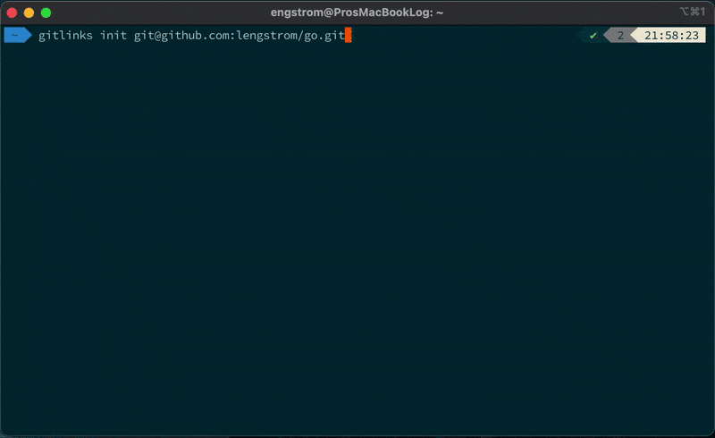
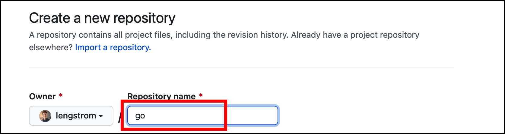
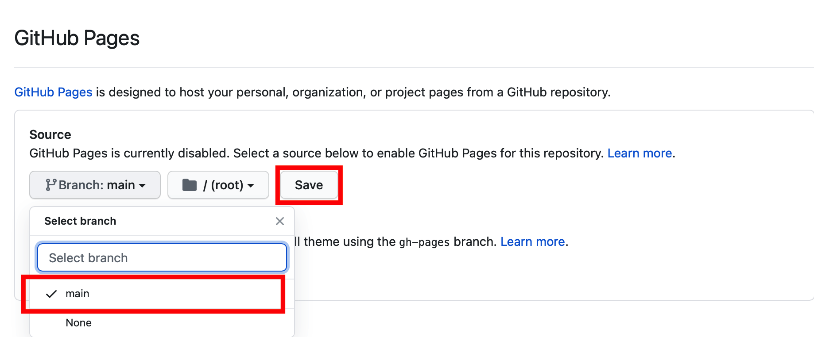
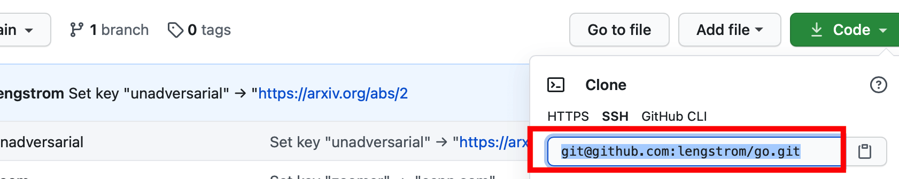

# `gitlinks` - Git Powered Go Links!
<p align = 'center'>
    Map memorable keys to URLS using Git and <a href="https://pages.github.com">GitHub Pages</a>: <code>pip install gitlinks</code>
    <br/>
    <p>
    
    </p>
    <p align = 'center'>
        <a href="#setup">Jump to setup!</a>
    </p>
</p>

# Quick Overview
<p>
<code>gitlinks</code> is a command line tool that maps keys to URLs via 
<a href="https://git-scm.com">Git</a> and <a href="https://pages.github.com">GitHub Pages</a>.
The following table shows example mappings for user <code>lengstrom</code>:
</p>

| Key           | URL                                                                                   | GitHub Pages Reference                                                                        |
| :------------ | :------------------------------------------------------------------------------------ | :-------------------------------------------------------------------------------------------- |
| `zoom`        | <a href="https://mit.zoom.us/j/95091088705">https://mit.zoom.us/j/95091088705</a>     | <a href="http://loganengstrom.com/go/zoom">http://loganengstrom.com/go/zoom</a>               |
| `classes/NLP` | <a href="https://canvas.mit.edu/courses/7503">https://canvas.mit.edu/courses/7503</a> | <a href="http://loganengstrom.com/go/classes/nlp">http://loganengstrom.com/go/classes/nlp</a> |

<p>
    Here, if user <code>lengstrom</code>
    maps <code>zoom</code> to <a href="https://mit.zoom.us/j/95091088705">https://mit.zoom.us/j/95091088705</a>,
    he (or any other user) can then access it at
    <a href="http://loganengstrom.com/go/zoom">http://loganengstrom.com/go/zoom</a>
    (since the GitHub pages site <code>lengstrom.github.io</code> maps to <code>loganengstrom.com</code>).
    We can also organize keys through nesting, such as with <code>classes/NLP</code>.
</p>
<p>
    Add, remove, and visualize link mappings through the command line!
</p>

```
$ gitlinks set zoom https://mit.zoom.us/j/95091088705
  => Success: Set key "zoom" → "https://mit.zoom.us/j/95091088705".
```
```
$ gitlinks delete zoom
  => Success: Deleted key "zoom".
```
```
$ gitlinks show
  == GitLinks (Remote: git@github.com:lengstrom/go.git) ==
  classes/nlp     →   https://canvas.mit.edu/courses/7503
  unadversarial   →   https://arxiv.org/abs/2012.12235
  zoom            →   https://mit.zoom.us/j/95091088705
```
<p>
    <code>gitlinks</code> also generates an index page for your GitLinks: see 
    http://loganengstrom.com/go/ as an example!
</p>

# Setup
Setup `gitlinks` in two ez steps!
## First: Cook up a new GitHub Repository
<p>
First, visit https://github.com/new and choose a short, memorable name like
<code>go</code> for your repository. Remember, a short shortlink <code>key</code> will reside at
<code>yourusername.github.io/repository_name/key</code>!
</p>

<p>
Now, check the box "Add a README file" (the repository can't be empty).
</p>

<p>
Make the repository, then go your repository's settings (e.g. <code>https://github.com/yourusername/repository_name/settings</code>).
Then, scroll down to the GitHub Pages section, and enable it for the `main` branch:
</p>


## Initialize `gitlinks` locally
<p>
    Install the <code>gitlinks</code> executable via <code>pip</code>: <code>pip install gitlinks</code>. Then, 
    initialize <code>gitlinks</code> to use the repository above: <code>gitlinks init remote_url</code>---where your remote URL
    can be found here:
</p>


# Shoutouts
- Tony Peng ([Twitter](https://twitter.com/iamtonypeng), [Website](http://tonypeng.com)) - for inspiring this project!
- Michael Yang ([Twitter](https://twitter.com/themichaelyang), [Website](http://yang.money)) - for some massive PRs and aesthetics expertise!

# License
GPL v3
